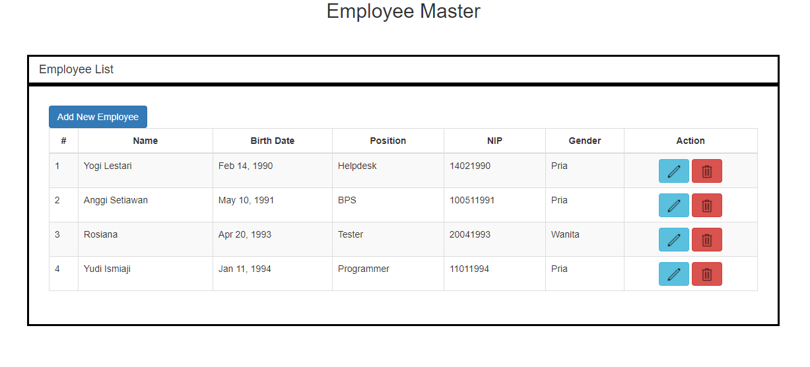
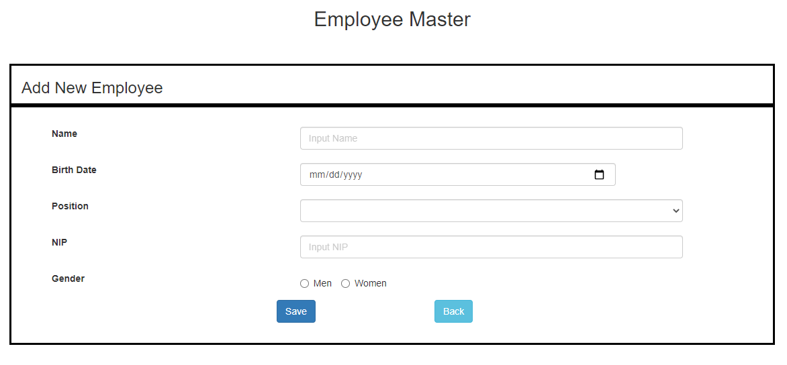
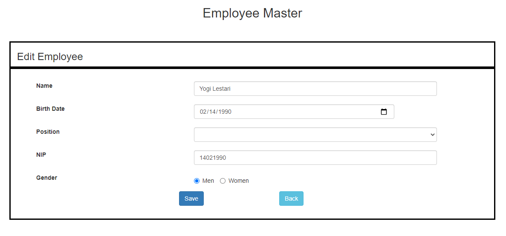
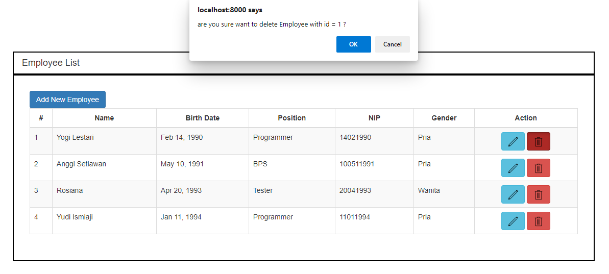
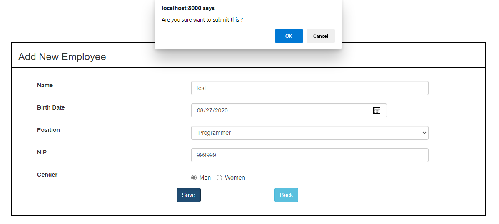
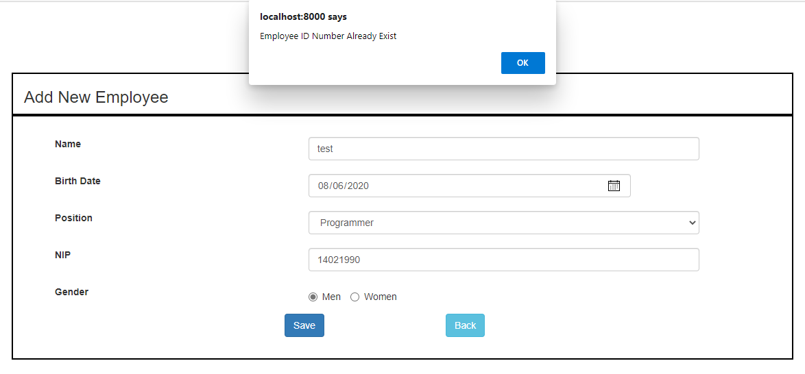

# company-CRUD

## Company CRUD with AngularJs for the FrontEnd and Java SpringBoot for the BackEnd

## 1. Requirements
```text
- Java version 1.8.0
- AngularJs version 1.7.5
```
## 2. DB Settings
```text
This is the DataBase settings used when creating this project
DB username : root
DB password :
```
## 3. Create Empty DataBase
```text
- Open terminal
- type "mysql -u {YOUR_DB_USERNAME} -p"
- then type "CREATE DATABASE company;"
```

## 3. BackEnd application.properties settings
```code
spring.datasource.url=jdbc:mysql://localhost/company?useSSL=false&serverTimezone=UTC
spring.datasource.username={YOUR_DB_USERNAME}
spring.datasource.password={YOUR_DB_PASSWORD}
spring.jpa.properties.globally_quoted_identifiers=true
server.port=8080

spring.jpa.hibernate.ddl-auto=update
spring.jpa.show-sql=true
```


## 4. How to run Java Spring Boot BackEnd
```text
#NOTE:You Must Use DB Username "Root" and DB Password "" or Blank to do below steps 

- Open terminal inside /BackEnd/target folder
- Type "java -jar valentino-0.1.jar"
```

## 5. How to Auto Populate Employee & Position Table
```text
- Open terminal
- Type "mysql -u {YOUR_DB_USERNAME} -p company < "company.sql"
```

## 6. How to run AngularJs FrontEnd
```text
- Open terminal inside /FrontEnd folder
- Type "npm run start"
```


## 7. ScreenShots
## Front End Index


## Front End Add Page


## Front End Edit Page


## Front End Delete Confirmation


## Front End Add Confirmation


## Front End Edit Confirmation


## Front End Add Duplicate NIP Error



