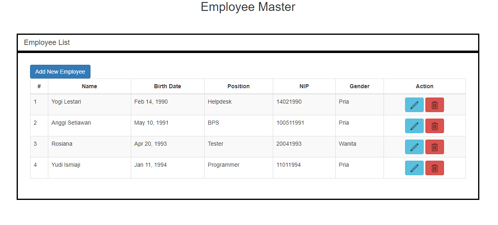
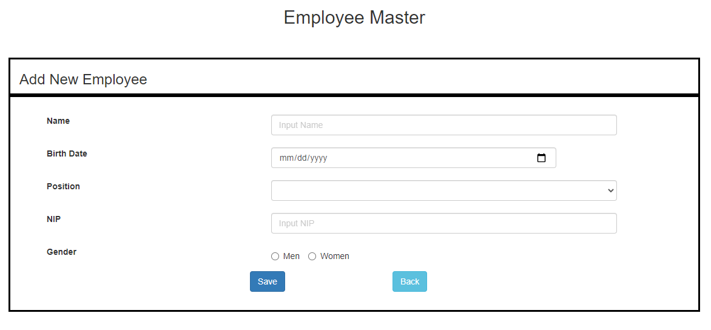
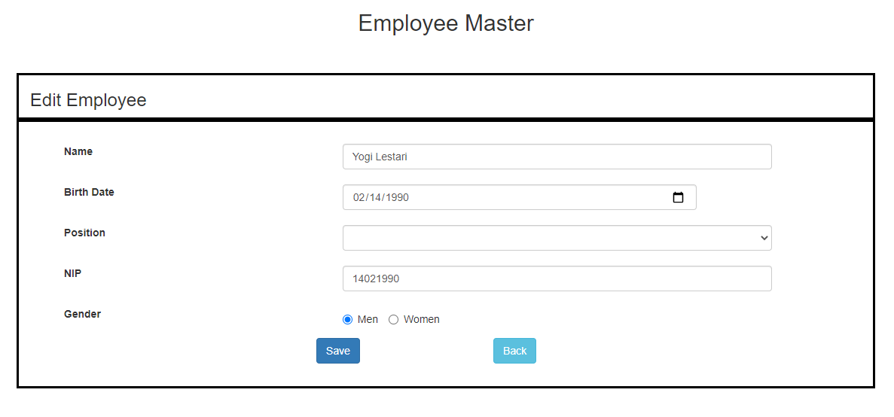
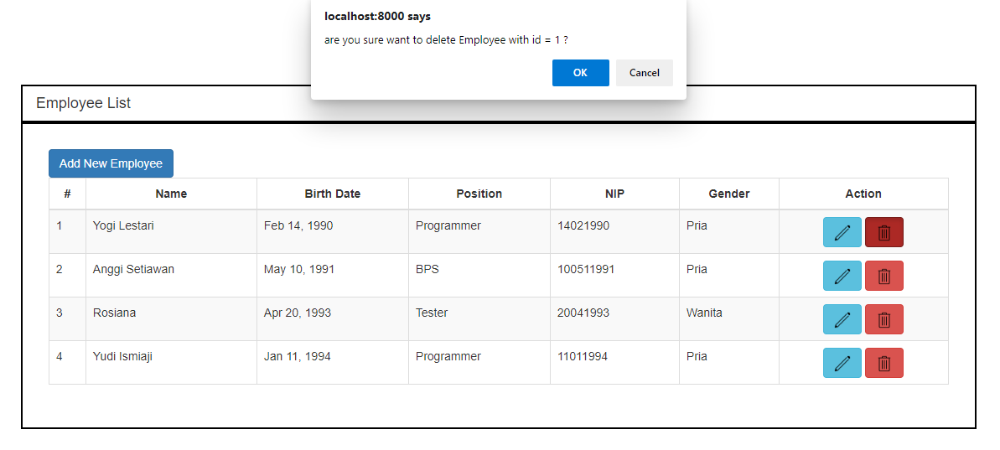
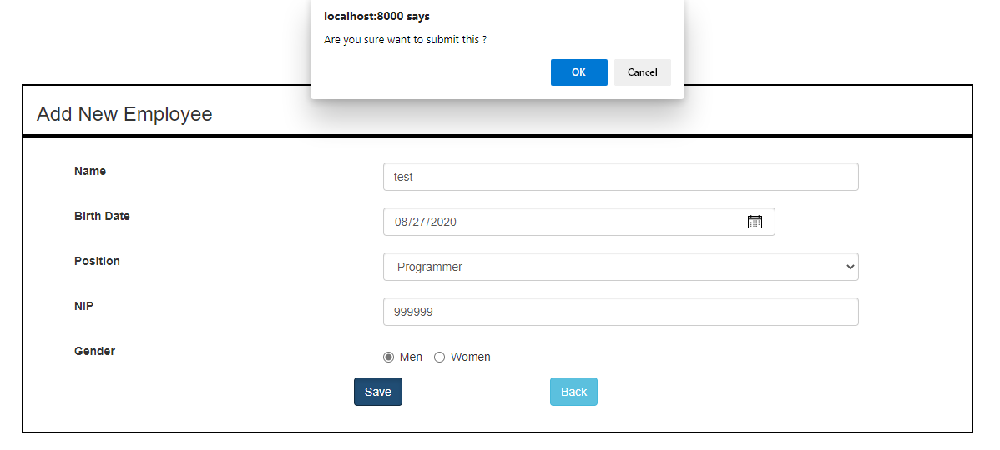
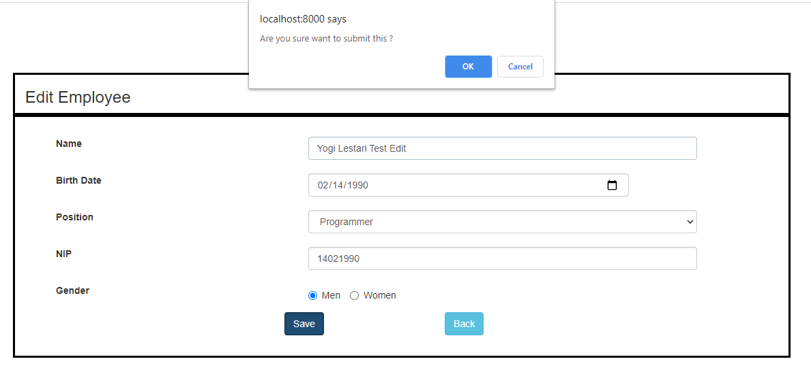
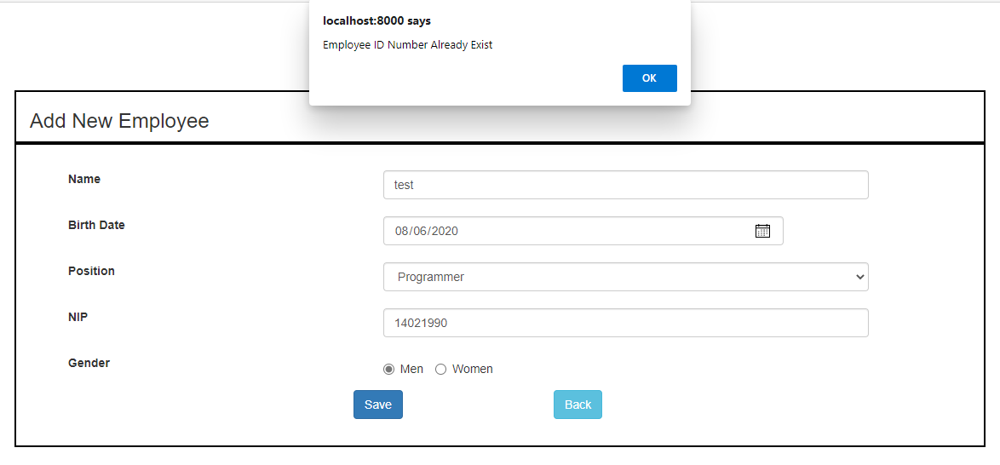

# company-CRUD

## Company CRUD with AngularJs for the FrontEnd and Java SpringBoot for the BackEnd

Requirements
```text
- Java version 1.8.0
- AngularJs version 1.7.5
```
## DB Settings
```text
DB name : company
DB username : root
DB password :
```

## How to import DB
```text
- Open terminal
- Type "mysql -u root -p company < "company.sql"
```


## How to run AngularJs FrontEnd
```text
- Open terminal inside /FrontEnd folder
- Type "npm run start"
```

## How to run Java Spring Boot BackEnd
```text
- Open terminal inside /BackEnd/target folder
- Type "java -jar valentino-0.1.jar"
```
## Front End Index


## Front End Add Page


## Front End Edit Page


## Front End Delete Confirmation


## Front End Add Confirmation


## Front End Edit Confirmation


## Front End Add Duplicate NIP Error



